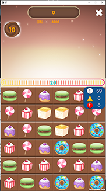

# 糖果消消乐
基于ET7.2开发的一款单机消消乐，基础玩法为点击拖拽糖果，在限定回合内达到指定积分即可通关。

# 运行指南
## 开发模式
有3种开发模式可以选择。先在菜单里选择 ET - BuildTool 打开 ET.BuildEditor 界面，然后选择对应的模式。
1. CodeMode 选择 Client Server, PlayMode 选择 Editor Simulate Mode。菜单里选择 ET - ChangeDefine - Add ENABLE_CODES。
   这种模式比较简单，不用 Build DLL, 不用构建资源，只能在编辑器里使用。
2. CodeMode 选择 Client, PlayMode 选择 Editor Simulate Mode。菜单里选择 ET - ChangeDefine - Remove ENABLE_CODES。
   这种模式下，改了代码后需要点击 BuildModelAndHotfix, 不用构建资源，只能在编辑器里使用。
3. CodeMode 选择 Client, PlayMode 选择 Host Play Mode, 菜单里选择 ET - ChangeDefine - Remove ENABLE_CODES。
   这种模式下，改了代码后需要点击 BuildModelAndHotfix，然后在菜单里选择 YooAsset - AssetBundle Builder 构建资源。改了资源后也需要构建资源。
   这种模式下可以在编辑器里和真机上运行。

## 打包流程
1.  ET.BuildEditor 里 BuildModelAndHotfix
2.  HybridCLR - Generate - All
3.  第一次打包，生成AOTDlls
4.  HybridCLR - CopyAOTDlls
5.  YooAsset 构建资源
6.  第二次打包

## 构建资源的方法
1. 首次构建资源包。
   菜单里选择 YooAsset - AssetBundle Builder 打开资源包构建工具。
   第一次构建资源时 Copy Buildin File Option 里选择 Clear And Copy All，构建完成后会生成一个带日期的目录，比如2023-04-10-1408，将这个目录改名为v1.0,
   然后复制到WEB服务器上的 CDN/{平台名称}/ 目录下。平台名称可选 PC, Android, IPhone, WebGL。可以在 MonoResComponent.GetHostServerURL() 修改服务器地址和这些参数。
2. 出补丁包。
   如果代码有改动，需要在 BuildEditor 里 BuildModelAndHotfix。
   然后打开资源包构建工具界面，Copy Buildin File Option 里选择 None，构建完成后将资源全选，然后复制覆盖到 CDN/{平台名称}/v1.0 目录里。

电脑上的缓存目录是 X-ET7/Unity/Sandbox，如果需要重新下载补丁可以删除这个目录。

---
# Reference
1. X-ET: 融合了 ET, FairyGUI, luban, YooAsset https://github.com/IcePower/X-ET7

